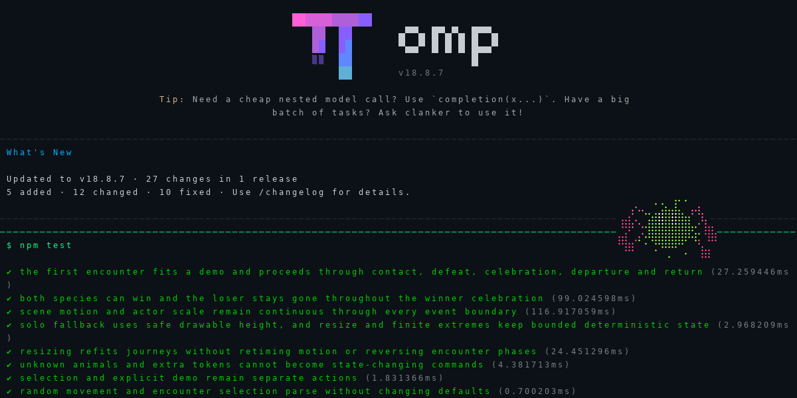
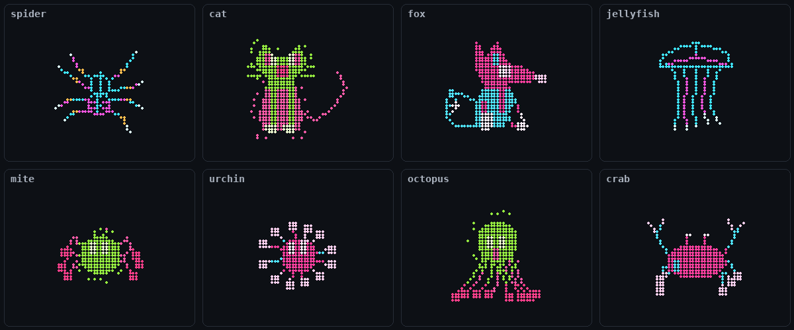
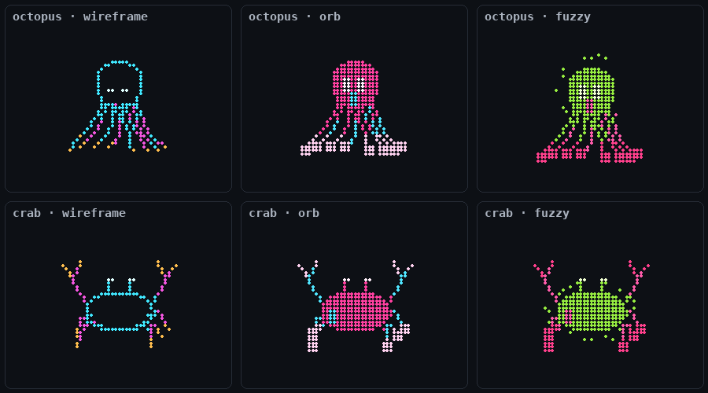
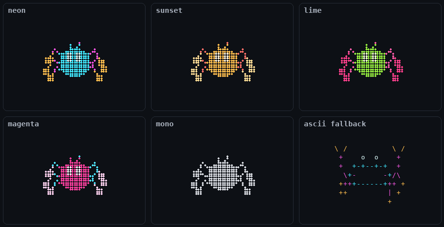
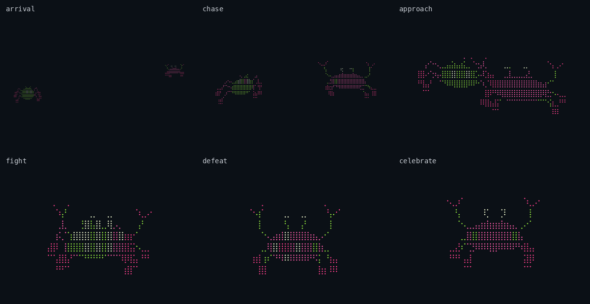
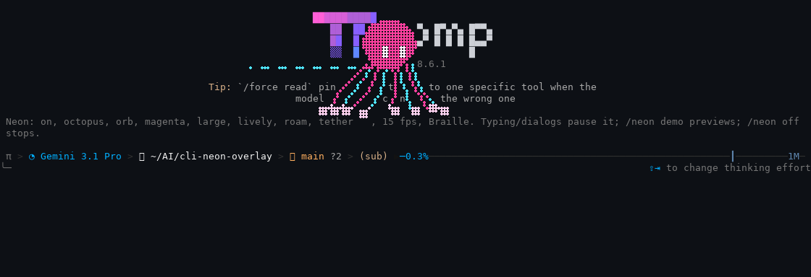
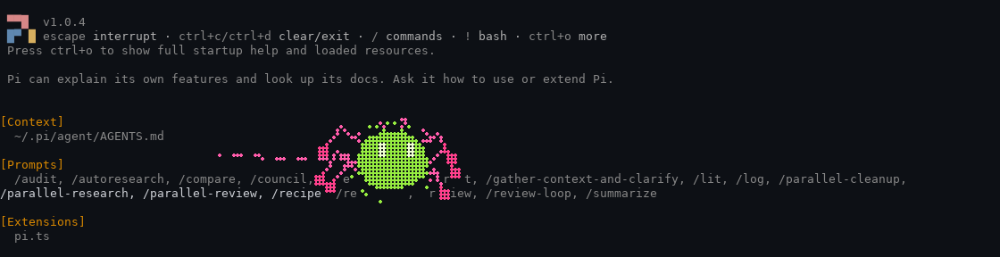

# CLI Neon Overlay

A little wildlife for your coding terminal.

Eight hand-built Braille animals roam above your prompt: sideways, vertically, diagonally and between corners. Occasionally a different animal arrives, chases, clashes in a cartoon tussle and shrinks away if it loses. Wind-up, gaze, limb drag, landing squash and a winner's bounce keep the movement expressive. Pick a look, pick a palette, and keep coding.



The 1.4.0 loop above shows a real OMP 18.8.7 session running random motion and encounters at 30 fps. It is reconstructed cell for cell from 15 Hz pane captures: 28 seconds, with arrival, chase, a cartoon clash, loser disappearance and a return to roaming. It is not a desktop screen recording. [Capture details](docs/operations/random-encounters-verification.md#readme-gif-and-publication-follow-up).

```bash
git clone https://github.com/Wayan123/cli-neon-overlay.git
cd cli-neon-overlay
npm run demo -- --animal mite --style fuzzy --theme lime
```

That runs the preview in any terminal with Node.js 22+. No `npm install`, no account, no network calls. Press `n` for the next animal, `y` for the next style, and `q` to quit.

## Meet the menagerie



| Animal | Personality | Try it |
| --- | --- | --- |
| `spider` | Eight jointed legs, slow rotation and scan strokes | `/neon demo spider` |
| `cat` | Pointed ears, whiskers, blinking eyes and a swinging tail | `/neon demo cat` |
| `fox` | Long muzzle, alert ears and a bushy swaying tail | `/neon demo fox` |
| `jellyfish` | A pulsing bell and trailing tentacles | `/neon demo jellyfish` |
| `mite` | Round body, tripod-gait legs with ball tips and big curious eyes | `/neon demo mite` |
| `urchin` | Spiny orb whose spines pulse and slowly turn | `/neon demo urchin` |
| `octopus` | Round mantle and eight waving, curling tentacles | `/neon demo octopus` |
| `crab` | Wide shell, eye stalks, scuttling legs and snapping claws | `/neon demo crab` |

Every animal is original procedural geometry. Nothing is copied from sprite packs.

## Three looks, five palettes



`wireframe` draws the outline. `orb` fills the body and gives limbs ball tips. `fuzzy` adds a flickering fur fringe around the filled body.



`neon` (cyan and magenta), `sunset` (amber and coral), `lime` (green and pink), `magenta` (pink and cyan) and `mono` (your terminal's own foreground). If your font has no Braille, `/neon ascii` switches to real line glyphs.

## Random routes and occasional encounters



These are cropped, cell-for-cell reconstructions of actual standalone preview captures, not a desktop screen recording. Both animals keep the selected style and palette; the visitor swaps its primary and secondary colors so the pair is easier to distinguish.

```text
/neon motion random
/neon encounters on
/neon fps 30
/neon on
```

`random` is now the default motion. Each session gets its own seed, with varied pauses, curved travel and horizontal, vertical and diagonal routes. The first visitor starts arriving after roughly 4–5 seconds, followed by a tussle and disappearance; subsequent visits are separated by solo roaming. Either animal can lose. If your selected animal loses, it returns after the visitor leaves.

Resize re-fits the same route progress instead of rewinding the encounter. Paths follow the available area: native overlays stay above the editor, while the preview uses the space between its header and controls. Two animals need at least 80 columns and 12 drawable rows; smaller areas show one complete animal instead. Fixed positions and other motion modes never start encounters.

Use `/neon encounters off` to keep random solo roaming. `/neon motion lively` restores the previous perch-and-dart behavior, including Pi's perches beside visible words.


## Living inside a real CLI

In OMP and Pi the animal is a native overlay: sparse single cells drawn on top of the interface, never a panel or a video.



*OMP 18.6.1: `/neon style orb`, `/neon theme magenta`, `/neon animal octopus`, `/neon size large`, `/neon on`.*



*Pi 1.0.4: the same steps with `fuzzy`, `lime` and `mite`. Pi lets the animal perch beside visible words; the dashed silk shows where it hopped from.*

Both images are real pane captures, redrawn cell for cell with their recorded colors.

## Try it inside OMP or Pi

Load the extension for one session straight from the checkout:

```bash
omp --no-extensions -e ./extensions/omp.ts
# or
pi --no-extensions -e ./extensions/pi.ts
```

Then type these into the CLI:

```text
/neon demo octopus
/neon style fuzzy
/neon theme lime
/neon fps 30
/neon on
/neon next
/neon off
```

`demo` shows the animal for 17 seconds, `on` keeps it visible, and `off` removes it. Typing hides it for a second so it never sits on your input. `--no-extensions` skips your other extensions for that run; leave it out if you need them, but do not load this one twice.

### Install it permanently

```bash
npm run install:omp
npm run install:pi
npm run install:both
```

Each command writes one small marked wrapper, `~/.omp/agent/extensions/cli-neon-overlay.ts` or `~/.pi/agent/extensions/cli-neon-overlay/index.ts`, that points at this checkout. Nothing is downloaded, and your provider, credentials and settings are untouched. Use `-- --dry-run` to see the targets first. Existing files the installer did not create are never overwritten.

Restart OMP, or run `/reload` in Pi. To remove it, run `npm run uninstall:omp` or `npm run uninstall:pi`. Keep the checkout in place while installed; if you move it, run the installer again from the new location.

By default the overlay runs in `auto` mode and appears only while the agent is working. Picking an animal or style does not turn it on; use `demo` or `on` for that.

### Every command

| Command | What it does |
| --- | --- |
| `/neon animal crab` | Pick any animal; `/neon crab` works too |
| `/neon next` | Cycle to the next animal |
| `/neon style orb` | `wireframe`, `orb` or `fuzzy` |
| `/neon theme lime` | `neon`, `sunset`, `lime`, `magenta` or `mono` |
| `/neon size large` | `small`, `medium` or `large`, shrunk to fit if needed |
| `/neon motion random` | `random` (default) routes and encounters; `lively` perches and darts; `normal`; `slow`; `still` freezes |
| `/neon position right` | `roam`, `left`, `center` or `right`; fixed positions do not dart |
| `/neon encounters off` | `on` (default) or `off`; visits require `random`, `roam` and enough space |
| `/neon tether off` | Show or hide the dashed silk during a dart |
| `/neon fps 30` | `15` (default) or `30` updates per second |
| `/neon ascii` / `/neon braille` | Line-glyph fallback or Braille subcell detail |
| `/neon auto` / `on` / `off` | While the agent works / always / never |
| `/neon demo [animal]` | 17-second preview of the current or named animal |
| `/neon status` | Current settings and why it might be paused |
| `/neon reset` | Back to the defaults and `auto` |
| `/neon list`, `/neon help` | Animals and commands, without changing anything |

Settings last for the session. A mistyped option shows the valid choices and changes nothing.

## The standalone preview

```bash
npm run demo -- --list
npm run demo -- --animal crab --style orb --fps 30
npm run demo -- --animal jellyfish --theme sunset --motion slow --position right
npm run demo -- --help
```

Keys: `n`/`p` animal, `y` style, `t` theme, `s` size, `m` motion, `l` position, `w` tether, `e` encounters, `f` fps, `a` ASCII/Braille, `q` or Escape to quit. The terminal is restored when it closes. This runs the same renderer as the native overlay, but outside any coding CLI.

## Next to Codex, Claude Code and other CLIs

Companion mode runs your CLI in one tmux pane and the animal in a second pane beside it. It needs tmux 3.2+ and Node.js 22+ on Linux, macOS or Windows via WSL. The launcher installs nothing.

```bash
npm run companion -- --animal octopus --style orb -- codex
npm run companion -- --animal fox -- claude
npm run companion -- --animal jellyfish --theme sunset -- opencode
npm run companion -- --ascii -- aider --model your-model
```

The first `--` belongs to npm. The second separates animal options from the command you are launching; everything after it goes to that CLI. To use it in another project, run `node /path/to/cli-neon-overlay/scripts/companion.mjs --animal cat -- codex` from that project.

- Focus starts in your CLI. Ctrl+B then Left/Right switches panes; the animal pane takes the same keys as the preview.
- Quit your CLI normally to close both panes, and its exit code is kept. Ctrl+B then d force-stops the session, so save your work first.
- Each launch uses its own private tmux socket and leaves your tmux setup alone.
- Start at 82×16 or larger; 120×30 is comfortable.

| CLI | How it runs | What you get |
| --- | --- | --- |
| OMP / Pi | Native extension | `/neon` commands, auto mode while the agent works, pauses while you type |
| Codex CLI / Claude Code | Companion pane | Animal beside the CLI; no `/neon` commands or busy detection |
| OpenCode / Gemini CLI | Companion pane | Specific versions run directly; notes below |
| Aider and other interactive commands | Companion pane | Should work the same way; not individually tested |

Codex CLI 0.159.1, Claude Code 2.1.63, OpenCode 1.15.3 and Gemini CLI 0.43.0 were run beside live animals on WSL, without logging in or sending model requests. OpenCode exposed a teardown bug that is now fixed. Gemini's own updater upgraded itself during that run, which this project does not control. Details: [multi-harness report](docs/operations/multi-harness-verification.md) and [direct CLI run report](docs/operations/live-cli-verification.md).

## Designed to stay out of your way

- Typing hides the overlay for one second, and dialogs hide it while open. Your keystrokes always go to the CLI.
- It uses only the upper part of the screen, needs at least 40×16 with eight clear rows above the editor, and pauses rather than clipping.
- Headless, print, JSON/RPC, non-TTY and subagent sessions never animate. `CLI_NEON_REDUCED_MOTION=1` turns the native overlay off; `--motion still` freezes the preview.
- At most 128 cells per animal and 256 for a complete two-animal scene including effects. In the current 200×60 renderer benchmark, mean frame cost was 0.10–0.29 ms, with 3.15 ms worst observed. These measurements exclude host rendering overhead. No audio, no model calls, no network requests.
- Cells cover the characters under them while visible; there is no transparency. OMP holds scrollback while overlays show, so prefer `auto` or `off` during long output.
- In `lively` mode, Pi perching skips rows with non-ASCII text because their cell positions cannot be known. OMP does not expose its screen text, so it uses wandering perches. `random` routes do not depend on text in either harness.
- Glow, gradients and soft fur are beyond what terminal cells can show; `fuzzy` suggests fur with Braille dots.

## The original recording

Before the lively update, this desktop recording showed the spider running over a real CLI session:


It is a 1486×754 capture of the supplied `assets/video-example.mp4`, converted to GIF without cropping or sound. It shows the earlier spider-only motion, not the current animals or styles.

## Hack on the menagerie

```bash
npm test
```

- `src/settings.mjs` holds the catalog and command parser.
- `src/renderer.mjs` holds the animal geometry, lively flight, styles and rasterizer.
- `src/scene.mjs` plans seeded routes, encounters, contact, disappearance and celebration.
- `src/perch.mjs` finds Pi perch spots in rendered lines.
- `src/extension.ts` handles native lifecycle and focus safety; `extensions/` only selects the harness.
- `scripts/demo.mjs` is the preview, `src/companion.mjs` with `scripts/companion.mjs` runs companion panes, and `scripts/install.mjs` manages the wrappers.

To add an animal: add it to `ANIMALS`, write its geometry (accept the `pose` gaze and drag offsets and add `fill` polygons for the filled styles), and extend the renderer tests. Commands, the preview and companion panes pick it up automatically. Please do not add third-party sprites without a compatible license.

## Design notes and proof

The 1.4.0 random routes and encounters have a [BMAD specification](docs/bmad/random-encounters-spec.md), [implementation plan](docs/bmad/random-encounters-plan.md) and [verification and critique report](docs/operations/random-encounters-verification.md). Live preview, companion, OMP 18.8.6 and Pi 1.1.0 were exercised on WSL; the older images and recordings above remain labeled historical evidence.

The 1.3.0 motion, styles, animals and 30 fps mode are documented with measurements in [the lively verification report](docs/operations/lively-verification.md). The multi-animal design lives in [the specification](docs/bmad/multi-animal-spec.md), [plan](docs/bmad/multi-animal-plan.md) and [verification](docs/operations/multi-animal-verification.md). Inspiration came from [Asciiquarium](https://github.com/craftzdog/asciiquarium-js), [Campy](https://github.com/dropdevrahul/campy) and the [CLI guidelines](https://clig.dev/#ease-of-discovery); no code or art from them is bundled. Earlier spider-only [design](docs/bmad/design.md), [verification](docs/operations/verification.md) and `artifacts/` are kept as history.

## License

[MIT](LICENSE), copyright 2026 Wayan123. The CLIs and projects mentioned here keep their own licenses.
