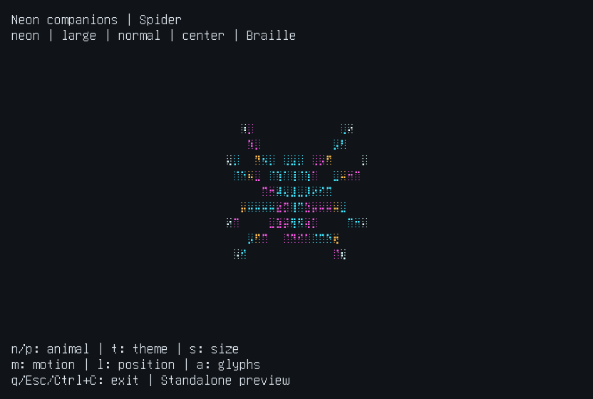

# CLI Neon Overlay

A little wildlife for your coding terminal.

Let a wireframe cat blink above your prompt, a spider wander through the output, a fox sway its tail, or a jellyfish drift while your agent works. Built for **OMP and Pi**, with a standalone preview you can try before installing anything.




[Watch or download the short MP4 demo](docs/media/demo.mp4). Images and video reconstruct real ANSI terminal output from a PTY, not a fabricated terminal UI or a desktop screenshot. The montage and animation above show the standalone preview; [OMP](docs/media/omp-cat.png) and [Pi](docs/media/pi-jellyfish.png) captures show the native overlays.

## Try a cat first

Requires **Node.js 22 or newer** and an interactive terminal. No `npm install`, account, API key, or runtime dependencies needed for this preview.

```bash
git clone https://github.com/Wayan123/cli-neon-overlay.git
cd cli-neon-overlay
npm run demo -- --animal cat
```

Press `n` / `p` to browse the animals, `t` for colors, `s` for size, `m` for motion, `l` for position, and `a` for ASCII/Braille. Quit with `q`, Escape, or Ctrl+C. The preview restores the cursor, alternate screen, and terminal input mode when it closes.

```bash
npm run demo -- --list
npm run demo -- --help
npm run demo -- --animal jellyfish --theme sunset --motion slow --position right
npm run demo -- --animal fox --ascii --size large
```

## Bring one into OMP or Pi

Install your preferred coding CLI separately. From this checkout:

```bash
npm run install:omp
# or
npm run install:pi
# or both
npm run install:both
```

The installer creates only a small extension wrapper in `~/.omp/agent/extensions/cli-neon-overlay.ts` or `~/.pi/agent/extensions/cli-neon-overlay/index.ts`. It does not download packages or change your provider, credentials, harness source, or settings. Run `npm run install:both -- --dry-run` to inspect the targets without writing anything. Unrelated existing files are never overwritten.

Restart OMP; in Pi, run `/reload` or restart. Then try:

```text
/neon list
/neon demo cat
/neon animal jellyfish
/neon theme sunset
/neon motion slow
/neon on
```

The default `auto` mode shows your companion only while the main agent works. Choosing an animal or style does not switch an idle/off overlay on. Use `demo` for a 17-second preview or `on` to keep it visible. Demo temporarily overrides `off`; after expiry, the previous mode applies. Its chosen animal stays selected.

### Pick your companion

| Animal | What makes it different | Preview |
| --- | --- | --- |
| `spider` | Eight jointed legs, slow rotation and local scan strokes | `/neon demo spider` |
| `cat` | Pointed ears, whiskers, blinking eyes and a swinging tail | `/neon demo cat` |
| `fox` | Long muzzle, alert ears and a bushy swaying tail | `/neon demo fox` |
| `jellyfish` | A pulsing bell and flowing trailing tentacles | `/neon demo jellyfish` |

### Tune the view

| Command | Choices / effect |
| --- | --- |
| `/neon animal cat` | Select `spider`, `cat`, `fox`, or `jellyfish`; `/neon cat` also works |
| `/neon next` | Cycle to the next animal |
| `/neon theme neon` | `neon` cyan/magenta, `sunset` amber/coral, `mono` terminal foreground |
| `/neon size medium` | `small`, `medium`, `large`; fitted down to available space |
| `/neon motion slow` | `still`, `slow`, `normal`; still freezes pose and position |
| `/neon position right` | `roam`, `left`, `center`, `right` in the safe upper area |
| `/neon ascii` / `/neon braille` | Real line-glyph fallback / subcell detail |
| `/neon auto` / `/neon on` / `/neon off` | Agent activity only / always / remove overlay |
| `/neon demo [animal]` | Preview the current or named animal for 17 seconds |
| `/neon status` | Current animal, style, mode, and pause reason |
| `/neon reset` | Restore default spider/style and auto mode; end the demo |
| `/neon help` or `/neon` | Show commands and examples without changing mode |

Preferences are session-local. Bad options show valid choices and leave the current state alone.

### No global installation

Run from the checkout:

```bash
omp --no-extensions -e ./extensions/omp.ts
pi --no-extensions -e ./extensions/pi.ts
```

`--no-extensions` disables discovery of your other extensions for that invocation. Omit it if you want them too, but do not load this extension twice.

### Remove it

```bash
npm run uninstall:omp
npm run uninstall:pi
```

Restart/reload afterward. Keep the checkout while installed: the wrapper references its absolute location. If you move the project, rerun the installer from the new location. If a legacy unmarked wrapper already occupies the target, inspect/remove that file yourself before installing; the installer deliberately refuses to take ownership of it.

## Designed to stay out of your way

- Typing hides the overlay for one second; dialogs hide it while they own focus. The extension never consumes your keystrokes.
- Only the upper safe area is used. Native overlay needs at least 40 columns × 16 rows and eight clear rows above the editor; smaller spaces pause instead of clipping. Standalone preview reserves extra rows for its own controls.
- Headless/print/JSON/RPC, non-TTY output, and subagent sessions do not animate.
- To disable the native overlay before launch: `CLI_NEON_REDUCED_MOTION=1 omp` or `CLI_NEON_REDUCED_MOTION=1 pi`. For a motionless standalone preview: `npm run demo -- --motion still`.
- Braille requires a font with U+2800–U+28FF support. If you see boxes, use ASCII. Choose `mono` for a palette that follows your terminal foreground; bright palettes work best on dark backgrounds.
- Sparse native cells temporarily cover characters beneath the animal; they do not cover a rectangular panel and are not alpha transparency. OMP holds scrollback commits while native overlays are visible, so `auto` or `off` is preferable during long output.
- Target updates are about 15 fps with a 128-cell ceiling. No audio, model calls, or extension network requests. Pixel glow and video-style text magnification are not simulated.

## Hack on the menagerie

```bash
npm test
```

`src/settings.mjs` owns the catalog and validated commands. `src/renderer.mjs` owns original procedural animal geometry and shared rasterization. `src/extension.ts` owns native lifecycle/focus safety; the files in `extensions/` only select the harness. `scripts/demo.mjs` runs the same renderer outside a harness, and `scripts/install.mjs` manages the marked wrappers.

To add a species, add its descriptor to `ANIMALS`, implement its geometry in the renderer, and extend the boundary/ASCII/animation checks. Catalog-driven commands and the standalone animal selector pick it up without a new lifecycle branch. Do not copy third-party sprites without a compatible license.

## Design, research and proof

The BMAD flow is recorded in [the multi-animal specification](docs/bmad/multi-animal-spec.md), [implementation plan](docs/bmad/multi-animal-plan.md), and [verification and critique](docs/operations/multi-animal-verification.md). The research draws on [Asciiquarium's species-driven animation](https://github.com/craftzdog/asciiquarium-js), [Campy's coding-agent companions](https://github.com/dropdevrahul/campy), and [CLI discovery guidelines](https://clig.dev/#ease-of-discovery). All shipped animal geometry is original; no source or art from those projects is bundled.

Earlier spider-only [design](docs/bmad/design.md), [verification](docs/operations/verification.md), and `artifacts/` remain historical evidence, not claims that every environment has been rechecked. Current platform limits and exercised versions are in the new verification report.
