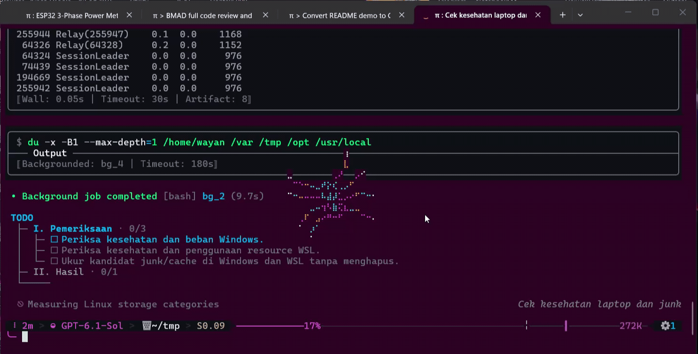
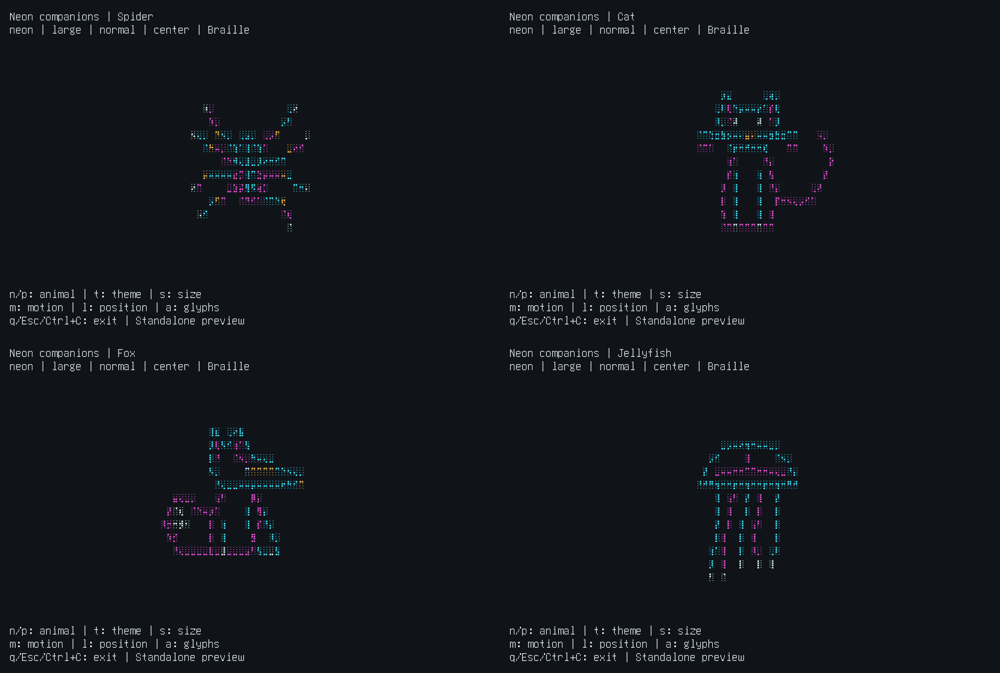

# CLI Neon Overlay

A little wildlife for your coding terminal.

Let a wireframe cat blink, a spider wander, a fox sway its tail, or a jellyfish drift while you code. Use a **native overlay in OMP/Pi**, or a **separate companion pane alongside Codex, Claude Code, and other terminal CLIs**. The standalone preview lets you try the animals before installing anything.

## Watch the actual CLI recording



The looping GIF above plays inline when you open this README. It comes from the replacement `assets/video-example.mp4`, showing the spider animated over a real coding CLI during a system-health check, not the separate standalone renderer or a reconstructed terminal. The full 1486×754 frame and complete video sequence are preserved; GIF conversion uses a 256-color palette and has no audio.

This clip shows the spider, not every animal or harness. It replaces the first recording that showed a server launch command. The new session's project text, local paths and diagnostic output remain as recorded; this is a demonstration of the overlay, not proof of a completed coding task. English descriptions accompany the original mixed-language CLI capture. The commands below let you run the effect yourself.

## Live demo inside OMP or Pi

Run the actual coding CLI with the native extension from this checkout:

```bash
git clone https://github.com/Wayan123/cli-neon-overlay.git
cd cli-neon-overlay
omp --no-extensions -e ./extensions/omp.ts
# Or use Pi:
pi --no-extensions -e ./extensions/pi.ts
```

Then enter these commands in the CLI itself:

```text
/neon list
/neon demo cat
/neon demo fox
/neon demo jellyfish
/neon ascii
/neon on
/neon next
/neon off
```

The animal is rendered live inside the OMP/Pi interface. Typing temporarily hides it; wait one second after entering a command to see it again. `demo` lasts 17 seconds, `on` keeps it visible, and `off` removes it. No video player or separate video file is involved. `--no-extensions` disables other discovered extensions for this invocation; omit it if you need them, and avoid loading this extension twice.

## Live preview without a coding harness

Requires **Node.js 22 or newer** and an interactive terminal. No `npm install`, account, API key, or runtime dependencies needed:

```bash
npm run demo -- --animal cat
```

This command runs the same animal renderer directly in your terminal. It is an interactive standalone preview, not video playback and not proof of a native harness integration.

Press `n` / `p` to browse the animals, `t` for colors, `s` for size, `m` for motion, `l` for position, and `a` for ASCII/Braille. Quit with `q`, Escape, or Ctrl+C. The preview restores the cursor, alternate screen, and terminal input mode when it closes.

```bash
npm run demo -- --list
npm run demo -- --help
npm run demo -- --animal jellyfish --theme sunset --motion slow --position right
npm run demo -- --animal fox --ascii --size large
```

## Run alongside Codex, Claude Code, or another CLI

Companion mode gives your harness its own terminal pane and puts the animal beside it. It uses **tmux 3.2+** on Linux, macOS or Windows via WSL, plus Node.js 22+. Install tmux and your chosen CLI separately; the launcher downloads nothing.

```bash
npm run companion -- --animal cat -- codex
npm run companion -- --animal fox -- claude
npm run companion -- --animal jellyfish --theme sunset -- opencode
npm run companion -- --ascii -- aider --model your-model
```

The first `--` belongs to npm. The second separates animal options from the executable and its arguments. Everything after that separator belongs to the harness, including flags such as `--help`.

To work in another project, change into that project and run the launcher by its path:

```bash
cd /path/to/your/project
node /path/to/cli-neon-overlay/scripts/companion.mjs --animal cat -- codex
```

Replace the example paths with your checkout/project locations. The harness keeps that working directory and your existing login/settings. There is no Codex/Claude extension to install, and the launcher does not change their configuration, permissions or first-run prompts.

- Keyboard focus starts in the harness. **Ctrl+B, then Left/Right** switches panes; use `n/p`, `t`, `s`, `m`, `l`, `a` in the animal pane. Ctrl+B twice sends a literal Ctrl+B to the harness.
- Exit the harness normally to close the companion; its exit code is preserved. **Ctrl+B, then d** ends this owned session and forcibly stops any remaining live host process group. Finish or save your work before detaching; do not use detach if you want the agent to continue.
- Each launch owns a private tmux socket. Existing tmux sessions and configuration are not modified. It can run from inside tmux too; the outer session's prefix may require Ctrl+B twice.
- Minimum starting size: 82 columns × 16 rows; 120 × 30 is more comfortable. tmux handles resizing; a cramped animal pane shows the preview's resize message.
- `--motion still` freezes the animation. `CLI_NEON_REDUCED_MOTION=1` starts this pane in still mode. `--ascii` avoids Braille font requirements.

### Compatibility is explicit

| Harness | Integration | Behavior |
| --- | --- | --- |
| OMP / Pi | Native extension | `/neon` commands, agent-busy auto mode, typing/dialog pause |
| Codex CLI / Claude Code | Companion pane | Harness and animal run in separate PTYs; no `/neon` injection or busy detection |
| OpenCode / Gemini CLI | Generic companion pane | Specific versions exercised directly; startup, controls and boundaries documented below |
| Aider and other installed interactive commands | Generic companion pane | Executable/argument examples; not individually verified here |

Codex CLI 0.159.1 and Claude Code 2.1.63 were launched in real PTYs on WSL alongside animated animals. Their folder-trust/first-run screens remained intact; no trust decision, login or model request was submitted. Generic input, resize, pane controls, detach/signal cleanup and terminal restoration were exercised separately. This is **not a transparent overlay inside Codex/Claude** and does not automatically pause when their agents are idle or typing. See [verification details](docs/operations/multi-harness-verification.md).

The revised live runs also exercised OpenCode 1.15.3 and Gemini CLI 0.43.0, alongside the native OMP/Pi demos and the standalone renderer. OpenCode exposed a hangup-resistant process that survived the earlier teardown; the launcher now stops its owned live process group, and an actual OpenCode rerun verified cleanup. Gemini's own startup auto-updater unexpectedly changed its installed version to 0.62.0; that newer version was not exercised, and no rollback was attempted. Third-party CLIs can have their own startup side effects even though this launcher does not install or update them. No trust/setup prompt or model request was submitted. Aider was unavailable and remains unverified. See [the direct CLI run report](docs/operations/live-cli-verification.md).

### Static terminal captures

These earlier images reconstruct terminal output and are kept only as additional species references. The primary video above is the supplied actual CLI recording, not these reconstructions or the old standalone montage.



Native reference captures: [OMP Cat](docs/media/omp-cat.png), [Pi Jellyfish](docs/media/pi-jellyfish.png).

## Bring one into OMP or Pi

Install your preferred coding CLI separately. From this checkout:

```bash
npm run install:omp
# or
npm run install:pi
# or both
npm run install:both
```

The installer creates only a small extension wrapper in `~/.omp/agent/extensions/cli-neon-overlay.ts` or `~/.pi/agent/extensions/cli-neon-overlay/index.ts`. It does not download packages or change your provider, credentials, harness source, or settings. Run `npm run install:both -- --dry-run` to inspect the targets without writing anything. Unrelated existing files are never overwritten.

Restart OMP; in Pi, run `/reload` or restart. Then try:

```text
/neon list
/neon demo cat
/neon animal jellyfish
/neon theme sunset
/neon motion slow
/neon on
```

The default `auto` mode shows your companion only while the main agent works. Choosing an animal or style does not switch an idle/off overlay on. Use `demo` for a 17-second preview or `on` to keep it visible. Demo temporarily overrides `off`; after expiry, the previous mode applies. Its chosen animal stays selected.

### Pick your companion

| Animal | What makes it different | Preview |
| --- | --- | --- |
| `spider` | Eight jointed legs, slow rotation and local scan strokes | `/neon demo spider` |
| `cat` | Pointed ears, whiskers, blinking eyes and a swinging tail | `/neon demo cat` |
| `fox` | Long muzzle, alert ears and a bushy swaying tail | `/neon demo fox` |
| `jellyfish` | A pulsing bell and flowing trailing tentacles | `/neon demo jellyfish` |

### Tune the view

| Command | Choices / effect |
| --- | --- |
| `/neon animal cat` | Select `spider`, `cat`, `fox`, or `jellyfish`; `/neon cat` also works |
| `/neon next` | Cycle to the next animal |
| `/neon theme neon` | `neon` cyan/magenta, `sunset` amber/coral, `mono` terminal foreground |
| `/neon size medium` | `small`, `medium`, `large`; fitted down to available space |
| `/neon motion slow` | `still`, `slow`, `normal`; still freezes pose and position |
| `/neon position right` | `roam`, `left`, `center`, `right` in the safe upper area |
| `/neon ascii` / `/neon braille` | Real line-glyph fallback / subcell detail |
| `/neon auto` / `/neon on` / `/neon off` | Agent activity only / always / remove overlay |
| `/neon demo [animal]` | Preview the current or named animal for 17 seconds |
| `/neon status` | Current animal, style, mode, and pause reason |
| `/neon reset` | Restore default spider/style and auto mode; end the demo |
| `/neon help` or `/neon` | Show commands and examples without changing mode |

Preferences are session-local. Bad options show valid choices and leave the current state alone.

### No global installation

Run from the checkout:

```bash
omp --no-extensions -e ./extensions/omp.ts
pi --no-extensions -e ./extensions/pi.ts
```

`--no-extensions` disables discovery of your other extensions for that invocation. Omit it if you want them too, but do not load this extension twice.

### Remove it

```bash
npm run uninstall:omp
npm run uninstall:pi
```

Restart/reload afterward. Keep the checkout while installed: the wrapper references its absolute location. If you move the project, rerun the installer from the new location. If a legacy unmarked wrapper already occupies the target, inspect/remove that file yourself before installing; the installer deliberately refuses to take ownership of it.

## Native overlays stay out of your way

- Typing hides the overlay for one second; dialogs hide it while they own focus. The extension never consumes your keystrokes.
- Only the upper safe area is used. Native overlay needs at least 40 columns × 16 rows and eight clear rows above the editor; smaller spaces pause instead of clipping. Standalone preview reserves extra rows for its own controls.
- Headless/print/JSON/RPC, non-TTY output, and subagent sessions do not animate.
- To disable the native overlay before launch: `CLI_NEON_REDUCED_MOTION=1 omp` or `CLI_NEON_REDUCED_MOTION=1 pi`. For a motionless standalone preview: `npm run demo -- --motion still`.
- Braille requires a font with U+2800–U+28FF support. If you see boxes, use ASCII. Choose `mono` for a palette that follows your terminal foreground; bright palettes work best on dark backgrounds.
- Sparse native cells temporarily cover characters beneath the animal; they do not cover a rectangular panel and are not alpha transparency. OMP holds scrollback commits while native overlays are visible, so `auto` or `off` is preferable during long output.
- Target updates are about 15 fps with a 128-cell ceiling. No audio, model calls, or extension network requests. Pixel glow and video-style text magnification are not simulated.

## Hack on the menagerie

```bash
npm test
```

`src/settings.mjs` owns the catalog and validated commands. `src/renderer.mjs` owns original procedural animal geometry and shared rasterization. `src/extension.ts` owns native lifecycle/focus safety; the files in `extensions/` only select the harness. `scripts/demo.mjs` runs the same renderer outside a harness, `src/companion.mjs` manages isolated tmux sessions for `scripts/companion.mjs`, and `scripts/install.mjs` manages the marked native wrappers.

To add a species, add its descriptor to `ANIMALS`, implement its geometry in the renderer, and extend the boundary/ASCII/animation checks. Catalog-driven commands and the standalone animal selector pick it up without a new lifecycle branch. Do not copy third-party sprites without a compatible license.

## Design, research and proof

The BMAD flow is recorded in [the multi-animal specification](docs/bmad/multi-animal-spec.md), [implementation plan](docs/bmad/multi-animal-plan.md), and [verification and critique](docs/operations/multi-animal-verification.md). The research draws on [Asciiquarium's species-driven animation](https://github.com/craftzdog/asciiquarium-js), [Campy's coding-agent companions](https://github.com/dropdevrahul/campy), and [CLI discovery guidelines](https://clig.dev/#ease-of-discovery). All shipped animal geometry is original; no source or art from those projects is bundled.

Earlier spider-only [design](docs/bmad/design.md), [verification](docs/operations/verification.md), and `artifacts/` remain historical evidence, not claims that every environment has been rechecked. Original terminal logs and earlier recordings are preserved as historical output, not translated or presented as the current demo. Current live-run results are in [the English/live CLI verification report](docs/operations/live-cli-verification.md).

## License

[MIT](LICENSE), copyright 2026 Wayan123. You may use, modify and redistribute the project under the license terms. Referenced third-party projects and the CLI harnesses retain their own licenses; their source/art is not bundled here.
